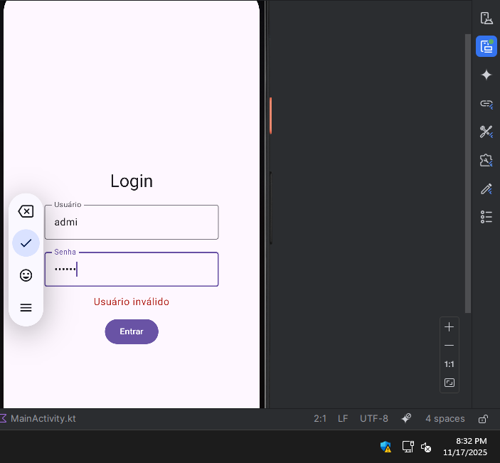
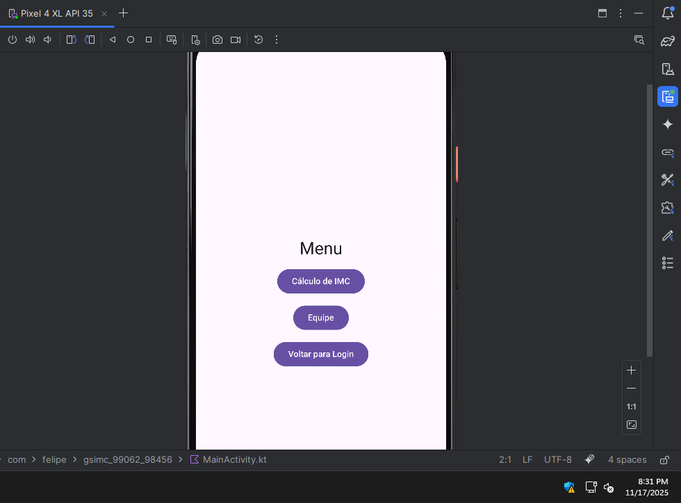
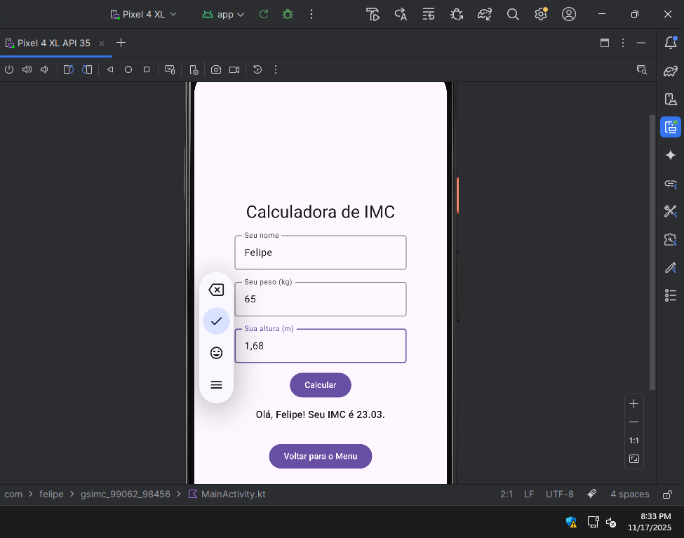
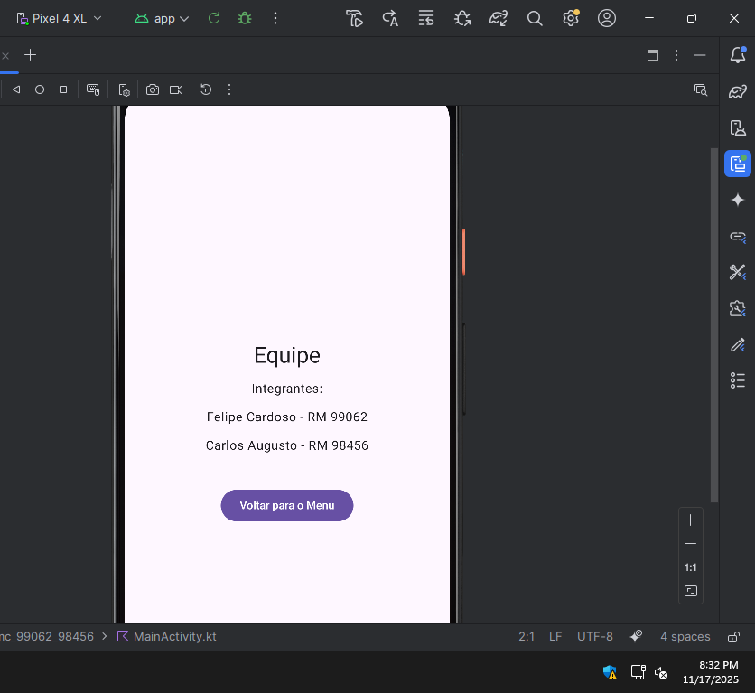

# GS 2 – Android Kotlin Developer  
## IMC + Navegação entre Telas (Jetpack Compose)

Este projeto foi desenvolvido como parte da GS 2 – 2025 – 3SIS – 2º Semestre, utilizando Jetpack Compose e Navigation Compose, conforme instruções fornecidas em aula e baseando-se nos repositórios de referência do professor.

---

## Integrantes da Equipe

- Felipe Cardoso - RM 99062
- Carlos Augusto — RM 98456

---

## Sobre o Projeto

O aplicativo apresenta:

- Tela de Login com validação de usuário e senha.  
- Tela de Menu com opções de navegação.  
- Tela de Cálculo do IMC, permitindo entrada de dados e exibição do resultado.  
- Tela de Equipe, contendo os integrantes do trabalho.  
- Navegação estruturada com `NavHost` e `NavController`.

---

## Funcionalidades

### 1. Tela de Login
- Usuário válido: **admin**  
- Senha válida: **123456**  
- Caso inválido, exibe mensagem de erro para o usuário.  
- Credenciais corretas direcionam para o Menu.

### Usuário Inválido

### 2. Tela de Menu
- Acesso ao cálculo de IMC  
- Acesso à tela da Equipe  
- Botão para voltar ao Login

### Tela Inicial (Login)

### 3. Tela de Cálculo do IMC
- Campos para entrada de nome, peso e altura  
- Cálculo do IMC e exibição do resultado  
- Botão para retornar ao Menu

### Tela de IMC

### 4. Tela da Equipe
- Exibe os nomes dos alunos participantes  
- Botão de retorno ao Menu

### Tela da Equipe

---

## Como Executar

1. Abrir o projeto no Android Studio  
2. Compilar com o comando **Run 'app'**  
3. Testar navegações e funcionalidades conforme solicitado no enunciado

---

## Notas Finais

O projeto foi desenvolvido seguindo as instruções da GS e as práticas abordadas durante o semestre, mantendo organização, clareza e funcionamento conforme solicitado.
